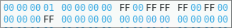
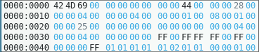

# RENDU SAE1.03 IMAGE
## A
### A.0 Expliquez ces valeurs -
L'erreur indique que la longueur de l'image et la taille du fichier ne concorde pas.  
Le fichier fait 816 026 octets  
Dans l'en tête du fichier bmp a l'adresser 0x02 la valeur qui est attribué a la taille total du fichier en octets est : 99 73 0C 00  
Elle se convertit en 000C7399, le poit faible est la valeur le plus a gauche
Cela donne 816 025 en base 10.  
**816 026 ≠ 816 025**  
Il faut donc modifier la valeur en ajoutant 1 a 9 pour donner : 000C739A qui s'écrirat : 9A 73 0C 00 dans Okteta
### A.1 Avec Okteta saisir de l'hexadécimal pour créer une image bmp de type Windows 2.0 -
Done 
### A.2 Modification d'image -
Done 
### A.3 Un Fichier BMP d'un type plus récent -
#### 1. Combien y-a-t-il de bits par pixel ?
Il y a 24 bits par pixels (18)16 = (24)10
#### 2. Quelle est la taille des données pixels ?
Elle est de 48 octets (30)16 = (48)10 
#### 3. Y a-t-il une compression utilisé ?
Nan il n'y a pas de compression utilisé (Type compression -> 00 00)
#### 4. Le codage des pixels a-t-il changé ? 
Non c'est tojours du RGB avec un octets par couleur
### A.4 Un Fichier BMP avec index de couleurs -
#### 1. Combien y-a-t-il de bits par pixel?
Il y a 1 bit par pixel (01)16 = (01)10
#### 2. Quelle est la taille des données pixels?
Elle est de 16 octets (10)16 = (16)10
#### 3. Y a-t-il une compression utilisée?
Non il n'y a pas de compression utilisé (Type compression -> 00 00)
#### 4. Comment sont codées les couleurs de la palette?
Les couleurs de la palette sont codées en 2^n, n est le nombre de bit par pixel donc le résultats est 2 car on a que 1 bit par pixel -> 2¹
#### 5. Quel est le nombre de couleurs dans la palette?
Les couleurs de la palette sont codées avec 02, en décimal cela donne 2 donc ma palette est constitué de 2 couleurs (adresse : 0x2E) 00 00 FF 00 | FF FF FF 00
#### 6. Le codage des pixels a-t-il changé?
Oui, les couleurs sont au debut avec don la couleur rouge et blanche sur 4 octets chacun, et enfin les lignes de pixel qui sont codées sur 4 octets par lignes
#### 7. Changez la couleur rouge des pixels en bleu pour obtenir l'image ci-dessous que vous nommerez ImageBleue.bmp.
FF 00 00 00 | FF FF FF 00 (ImageBleue.bmp)
#### 8. Inversez le damier : les blancs à la place des bleus et les bleus à la place des blancs, pour obtenir l'image ci-dessous.
Pour inverser le damier je vais échanger les lignes qui décrive le dammier pour obtenir le damier inverser (ImageBleueInverse.bmp)
#### 9. Modifiez le fichier  en mode index de couleurs avec okteta de façon à obtenir ceci. Enregistrez cette image sous ce nom Image3.bmp:
Après avoir fait la conversion en binaire des valeurs hexadecimal on peut observer que le schéma des pixels est représenter, quand le bit est a 0 la couleur est rouge et 1 la couleur est blanche comme défini dans les valeurs de la palette de couleurs ->  
F0 00 00 00 | 00 00 00 00 | 00 00 00 00 | A0 00 00 00  
Avec ca on a donc l'image3
#### 10. Passez le fichier de l'ancien logo du Département d'Informatique en mode index de couleurs:
#### 11. A quelle adresse peut-on trouver le nombre de couleurs qu'il y a dans la palette?
a l'adresse Ox2E qui est égale a (1O)¹⁶ = (16)¹⁰ comme définis dans la commande pour convert
#### 12. A quelle adresse dans la palette peut-on trouver la couleur à dominante "Blanc" utilisée par cette image?
On peut trouve le blanc a l'adresse 0x66 sous la forme -> FE FE FD 00
#### 13. Où commence le tableau de pixel?
On peut trouver l'adresse de où commence le tableu a l'adresse 0x0A qui est donc 0x76
#### 14. En modifiant l'Hex,  placez quelques pixels bleus tout en bas de l'image.
J'ai chercher une teinte de bleu dans la palette et ensuite modifier les premier caractère en hexa du tableau pour la donner la valeur 6 car ma teinte de bleu se trouve a la 6ème position dans la palette
#### 15. Que se passe-t-il si l'on diminue le nombre de couleurs dans la palette? Que se passe t-il d'un point de vue visuel? Et dans l'hexa?
D'un point de vu visuel l'image n'a plus que 4 couleur : blanc,gris et 2 teintes de bleu et dans l'hexa on observe que la palette a mis de la place pour une palette de 16 couleurs mais que seulement 4 sont utilisées et que les pixels sont définis par 0,1,2 ou 3.
### A.5 Utilisation des négatifs -
#### 2. Changez dans l'entête du fichier la valeur de la hauteur de l'image. Elle est à l'origine de valeur 4 pixels, changez pour la valeur négative de  -4 pixels. Que ce passe-t-il?
Pour inverser la valeur 4 en -4 il faut inversesr tout les bits dans la représentation de la valeur de hauteur dans l'en tête : 04 00 00 00
-> FC FF FF FF
#### 3. Profitez de cette information pour obtenir facilement à partir de ImageExempleIndexBMP3_16.bmp
A9 01 00 00 -> 56 FE FF FF
### A.6 Un fichier BMP avec compression
#### 1. Quel est le poids du fichier? Pourquoi? Que c'est-il passé?
60 04 00 00 -> (00 00 04 60)¹⁶ = (1120)¹⁰ octets  
Le poid du fichier a augmenter 102 -> 1120 octets
Car la palette de couleurs laisse de la place pour 256 couleurs
#### 2. Trouvez dans l'entête l'offset que donne l'adresse de début des pixels.
36 04 00 00 donc le début des pixels se trouve a l'adresse 0436
#### 3. Décodez le code des pixels. (C'est-a-dire essayez de retrouver dans l'hexadécimal le codage des pixels et expliquez-le)
Voici donc les valeurs hexadecimal de l'adresse du début des pixels jusqu'a la fin :  
01 00 01 01 01 00 01 01 00 00 01 01 01 00 01 01 01 00 00 00 01 00 01 01 01 00 01 01 00 00 01 01 01 00 01 01 01 00 00 00 00 01  
Après lectures des documents on peut observer donc que le premier octets définis le nombre de pixels qui auront la valeurs de l'octets suivant. Donc 01 00 sinifie que 1 pixel sera a la valeur 0 ce qui signifie que 1 pixel sera de couleur rouge par rapport a la palette de couleur du fichier.  
On peut observer aussi que tout les 4 pixels : 00 00 qui se rapporte a la fin d'une ligne
Et que a la fin du bitmap on  a : 00 01 ce qui se rapporte a la fin du bitmap
### A.7 
#### 1. Quel est le poids du fichier Image5.bmp? Pourquoi est-il moins grand que celui de l'image Image4.bmp?
Poids du fichier a l'adresse 0x02 : (00 00 04 4E)¹⁶ = (1102)¹⁰  
Le fichier est moins grand que L'Image4 car on peut voir que l'image a de plus grande suite de pixels de la même couleurs et grace a la compression cela rend moins lourd le fichier.
#### 2. Décodez le code des pixels. (C'est-a-dire essayez de retrouver dans l'hexadécimal  le codage des pixels et expliquez-le)
Voici les valeurs hexadecimal a l'adresse du début du bitmap :  
01 01 01 00 01 01 01 00 00 00 04 00 00 00 04 00 00 00 04 01 00 00 00 01  
On peut principalement lire ceci  
01 01 -> 1 pixel blanc  
01 00 -> 1 pixel rouge  
04 00 -> 4 pixel rouge  
Le plus gros changement ce retrouve donc sur les suites des 4 pixels rouges qui est représenter avec moins de valeur que sur l'Image3
### A.8
#### Modifiez le fichier Image5.bmp afin d'obtenir cette image que vous nommerez Image6.bmp . Attention vous devez modifier directement dans le code compressé.
Les changements :   
01 01 01 00 01 01 01 00 00 00 04 00 00 00 04 00 00 00 04 01 00 00 00 01 (Image5)
  
->  
01 01 01 01 01 00 01 01 00 00 04 00 00 00 04 00 00 00 01 01 01 00 01 01 01 00 00 00 01 (Image6)
  
J'ai donc modifier la suite des 4 pixels blanc a la fin et les valeurs pour le bas de l'image  
A la suite des modifications le poids du fichier a changé je dois donc modifier dans le header la valeur  
4E 04 -> 53 04  
1102 -> 1107
### A.9
#### Modifiez le fichier Image6.bmp afin d'obtenir cette image que vous nommerez Image7.bmp . Attention vous devez modifier directement dans le code compressé.
Les changements  
J'ai commencer par rajouter la couleur bleu et verte dans la palette de couleurs du fichier :  
FF 00 00 00 (Bleu)  
00 FF 00 00 (Vert)  
  
Puis j'ai modifier les index de couleurs dans le bitmap pour correspondre a l'image d'exemple :  
01 01 01 01 01 00 01 01 00 00 04 00 00 00 04 00 00 00 01 01 01 00 01 01 01 00 00 00 01 (Image6) 

->  
01 01 01 01 01 **02** 01 01 00 00 04 00 00 00 04 **03** 00 00 01 01 01 00 01 01 01 00 00 00 01 (Image7)

### A.10
#### Modifiez le fichier Image7.bmp afin d'obtenir cette image que vous nommerez Image8.bmp . Attentio  n vous devez modifier directement dans le code compressé.
Les changements :  
01 01 01 01 01 **02** 01 01 00 00 04 00 00 00 04 **03** 00 00 01 01 01 00 01 01 01 00 00 00 01 (Image7)
  
->  
01 01 01 01 01 02 01 01 00 00 01 00 01 03 02 00 00 00 02 03 01 00 01 03 00 00 01 01 01 00 01 01 01 00 00 00 01 (Image8)
  
On peut ensuite réduire la palette de couleur  
A la suite des modifications le poids du fichier, le nombres de couleurs dans la palette, le nombres de couleurs importantes et l'adresse de où commence le bitmap, après les modifications le header ressemble a ceci :   

## B
### B.1 Passons à la manipulation d'image en PYTHON 
####Avec ces éléments créez un programme python qui transpose une image: 